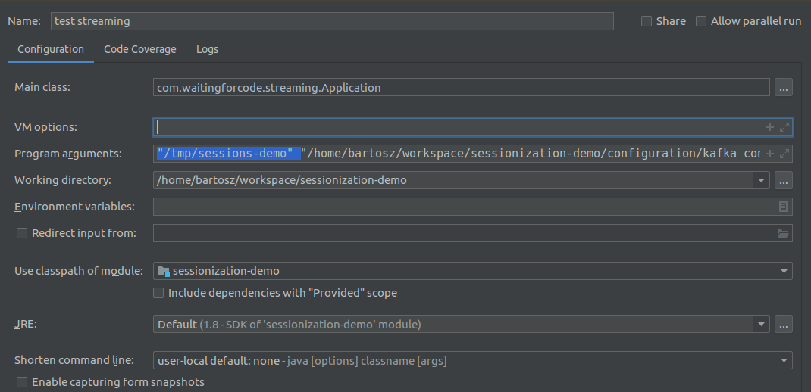
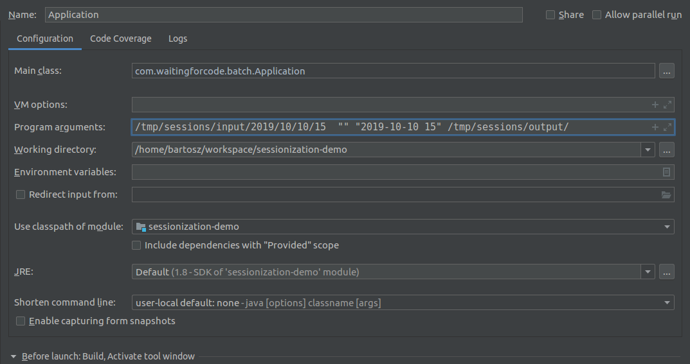

This project gives 2 solutions to solve sessionization problem with Apache Spark.

# Sessionization 
## Definition
A sessionization problem tries to group events related to one specific entity (user, device, ...). It can be considered as
a window accumulating all activity for given entity, followed either by a period of inactivity or an explicit event 
closing the window.

For example a user made the following actions: ("click", "2019-01-31 20:00"), ("link hover", "2019-01-31 20:03"),
("click", "2019-01-31 20:06"), ("click", "2019-01-31 20:10"). We generate the session after "browser_close" action or 
10 minutes of inactivity. In that case, we compute the session at 20:20 and the session itself has the following format: 
`{"user_id": ..., "actions": ["click", "link hover", "click", "click"], "duration_sec": 600, "end_reason": "inactivity"}`.

## Solutions
### Streaming
To solve a sessionization problem with streaming, we can use different patterns but the most common one is **stateful
processing**. Depending on our final session, we'll accumulate the events in some state, detect the termination action
and generate the output. The state can have different format. It can be stored in an external data store with a fast
access (in-memory cache, K/V store with miliseconds latency). The state can also be persisted in the main memory of the
application and be backed up in a checkpoint.

### Batch
If higher latency is allowed, batch approach can also be used to solve sessionization problems. The idea is to store
all user actions on a distributed and scalable file system (S3, GCS, ...) and generate sessions at regular interval, 
ideally from an orchestrator. The key point here is to guarantee sequentiality of the execution. It means that the
generation for *H* can only start if the generation for *H-1* terminated correctly. To increase the performance, 
files should be partitioned by event time. Thanks to that, we won't need to filter out the events happened during last 
24 hours for the last generation of the day.

## Tests
To test the application you have to generate some test data. Both streaming and batch versions use 
my [data generator](https://github.com/bartosz25/data-generator) simulating user visits on a website.
### Streaming
1. Go to your working directory
2. `git clone git@github.com:bartosz25/data-generator.git`
3. Follow the README from https://github.com/bartosz25/data-generator/tree/master/examples/kafka
4. Start streaming application `com.waitingforcode.streaming.Application "/tmp/sessions-demo" "/home/bartosz/workspace/sessionization-demo/configuration/kafka_configuration.json"`, an IntelliJ's example:

### Batch
1. Go to your working directory
2. `git clone git@github.com:bartosz25/data-generator.git`
3. Follow the README from https://github.com/bartosz25/data-generator/tree/master/examples/local_filesystem
4. Start batch application `com.waitingforcode.batch.Application /home/bartosz/tmp/test_generator/2019/08/11/09  "" "2019-08-11 09"`
where "/home/bartosz/tmp/test_generator/2019/08/11/09" is the input directory, "" previous session's directory and "2019-08-11 09" processed time

## Why Maven?
I experienced that `sbt` doesn't work perfect in every configuration, like the one behind a corporate proxy. To simplify
testing, I decided to use more classical Maven.

## Further reading
* [Spark+AI Summit 2019 presentation](https://databricks.com/session_eu19/using-apache-spark-to-solve-sessionization-problem-in-batch-and-streaming)
* [blog posts on waitingforcode.com](https://www.waitingforcode.com/tags/spark-summit-2019-talk-notes)
